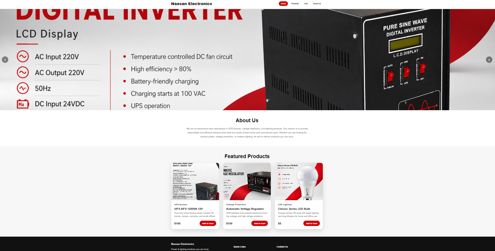
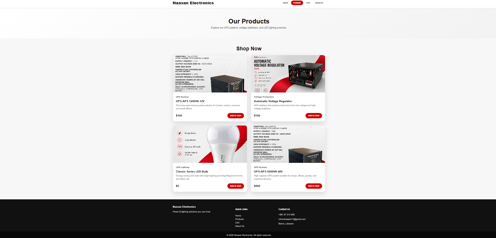
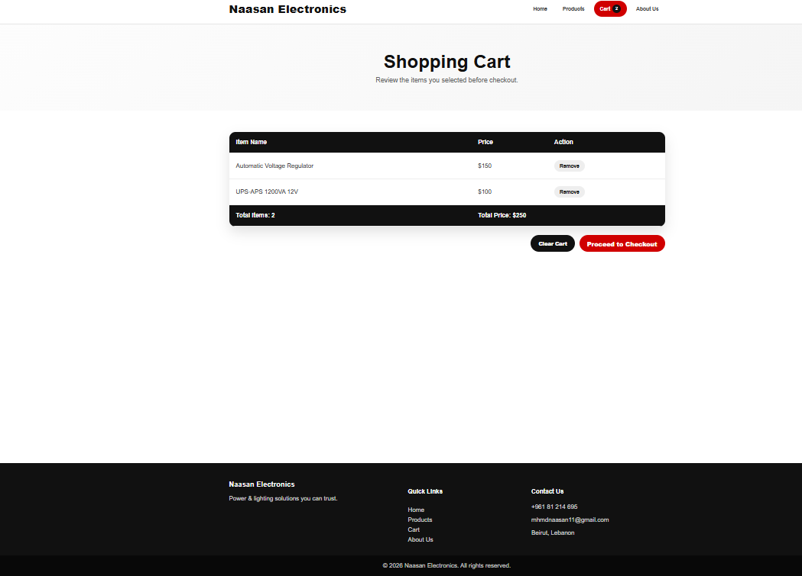
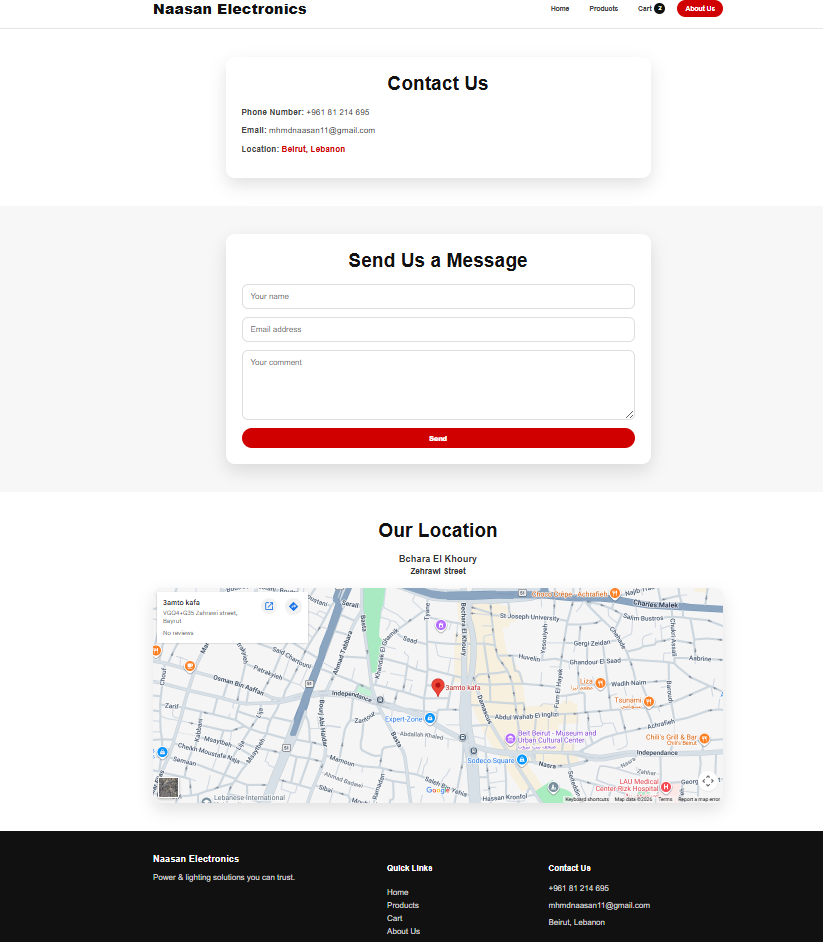
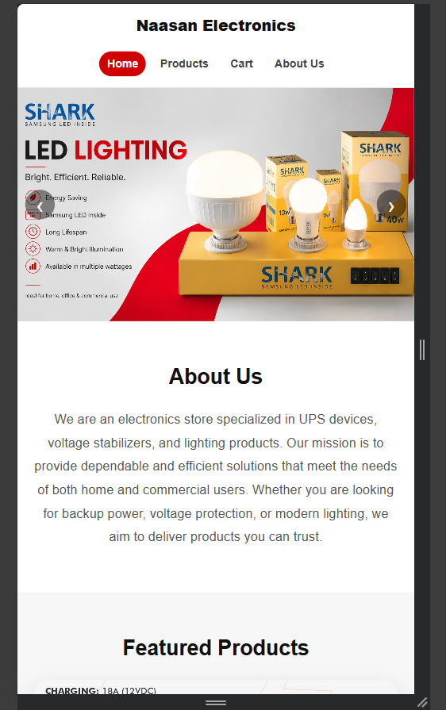

# Naasan Electronics

Naasan Electronics is a ReactJS frontend web application for an electronics store. It displays UPS devices, voltage stabilizers, LED lighting products, a cart page, and contact information.

## Technologies Used

- ReactJS
- JavaScript
- CSS
- Vite
- Git and GitHub

## Pages

- Home
- Products
- Cart
- About Us / Contact

## Setup Instructions

```bash
npm.cmd install
npm.cmd run dev
```

Then open the localhost link that appears in the terminal.


## Screenshots

### Home Page



### Products Page



### Cart Page



### About / Contact Page



### Mobile Responsive View




## Project Status

The project is completed and ready for deployment and submission.

## Live Demo

The project is deployed online here:

https://naasan-electronics-react1.vercel.app/


